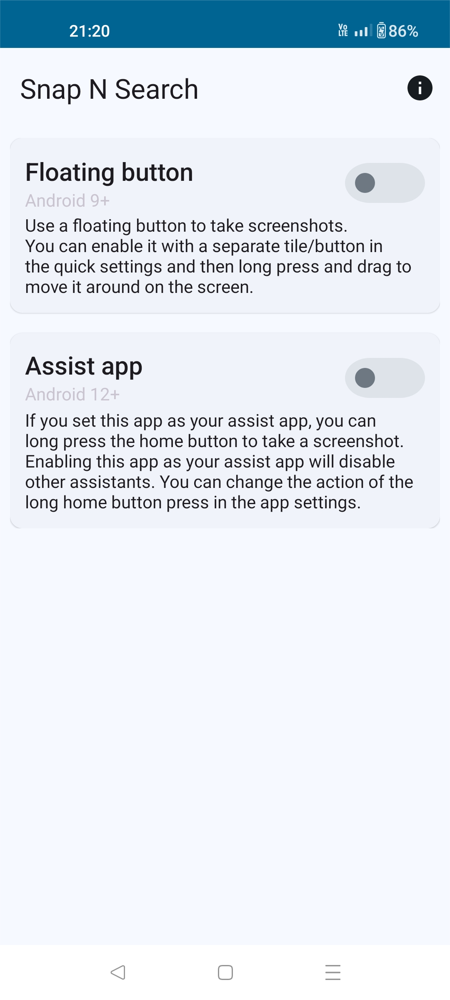
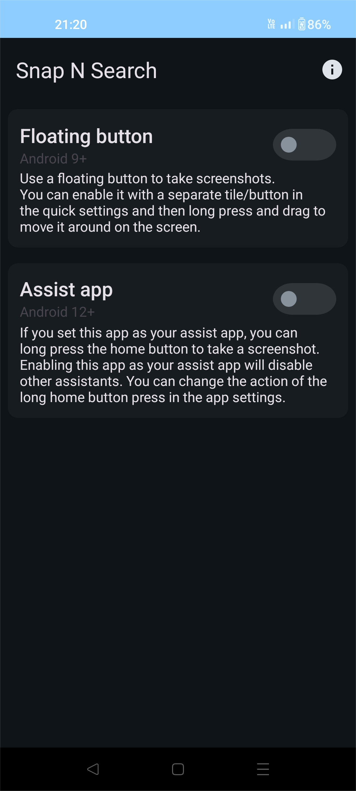
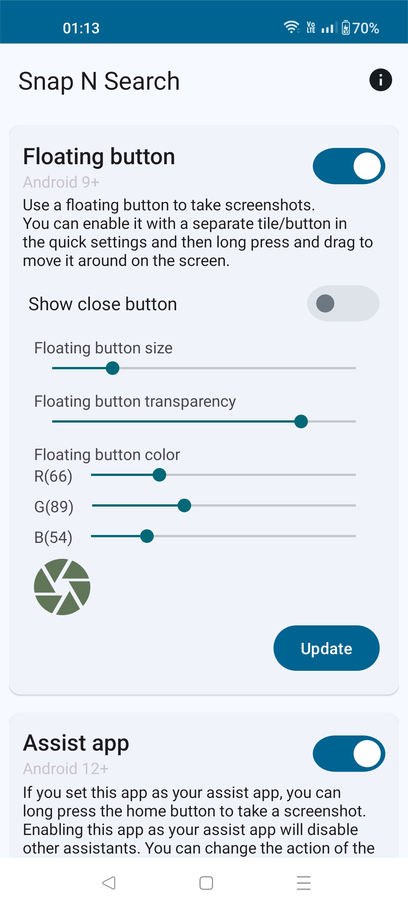
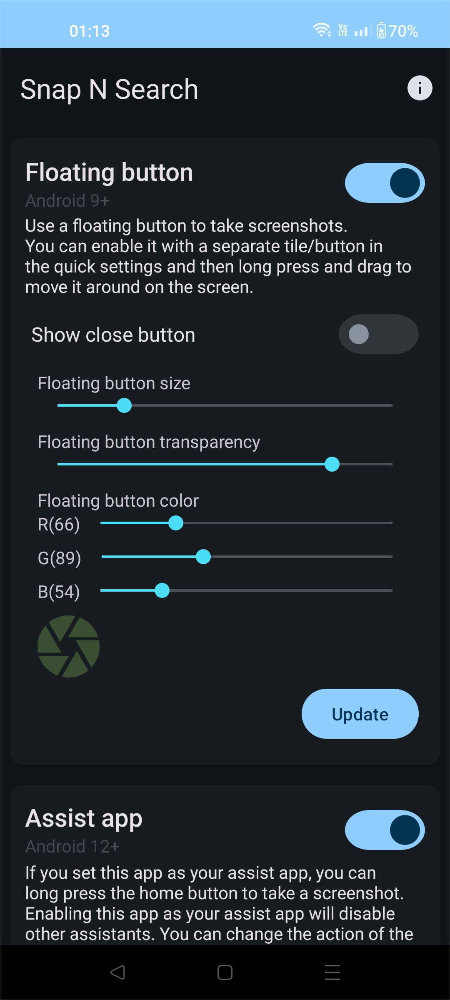
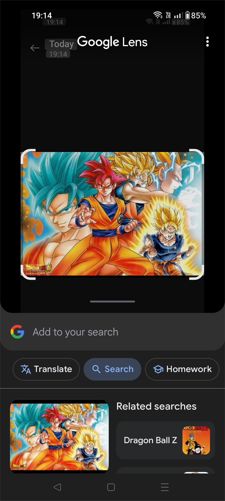

<h1 style="text-align: center;">Snap N Search</h1>

Snap N Search is a free, open-source Android app that allows users to take screenshots and search
using Google Lens. It's designed for users who want instant information about anything they see on
their screen.

**Note: This app requires the Google Lens app to be installed on your device.**

## Screenshots

## Features

- **Effortless Screenshot Capture:**

  - **Snap Button (Android 9+):** Snap & Search screenshots using a floating button.
  - **Long-Press Home Button (Android 12+):** Snap & Search screenshots by long-pressing the home
    button.

- **Google Lens Integration:** Seamlessly search your screenshots using Google Lens for detailed
  information about objects, text, landmarks, and more.

- **Minimal Permissions:** The app does not require storage permissions or constant internet access,
  except when using Google Lens.

## Usage

**On Android 9+:** Tap the snap/floating button.

https://github.com/user-attachments/assets/cb8b49b7-5860-4ae3-9777-8bb8b3184e14

**Note:** If the app name is greyed out, you need to allow restricted settings. Follow the on-screen
instructions to enable it.

https://github.com/user-attachments/assets/5ececb8a-6d4b-42a7-b5e2-ba5332f06191

**On Android 12+:** Long-press the home button (after setting Snap N Search as default assistant).

https://github.com/user-attachments/assets/641b9364-bb24-4dff-9231-9846b07d8c42

**On Android 12+:** Use gestures (swipe up from bottom corners of the screen).

https://github.com/user-attachments/assets/e1ec424f-2716-4d8f-9144-589b5b04dd3a

## Credits

### Open Source Project

[Screenshot Tile](https://github.com/cvzi/ScreenshotTile)

## License

Snap N Search is licensed under the GNU General Public License v3.0. See the [LICENSE](LICENSE) file for more information.
